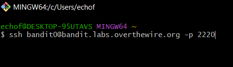
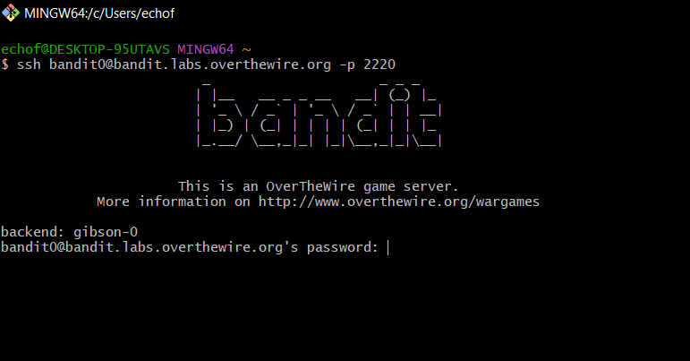
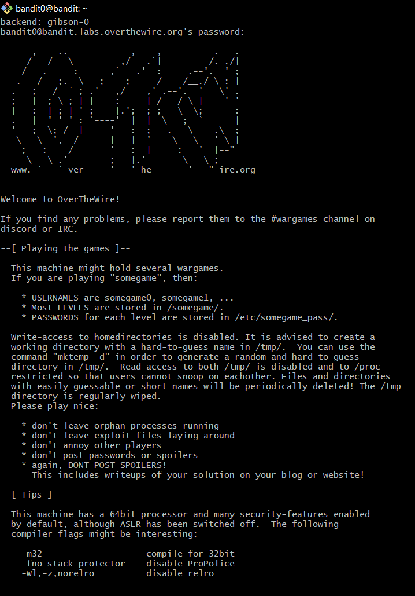
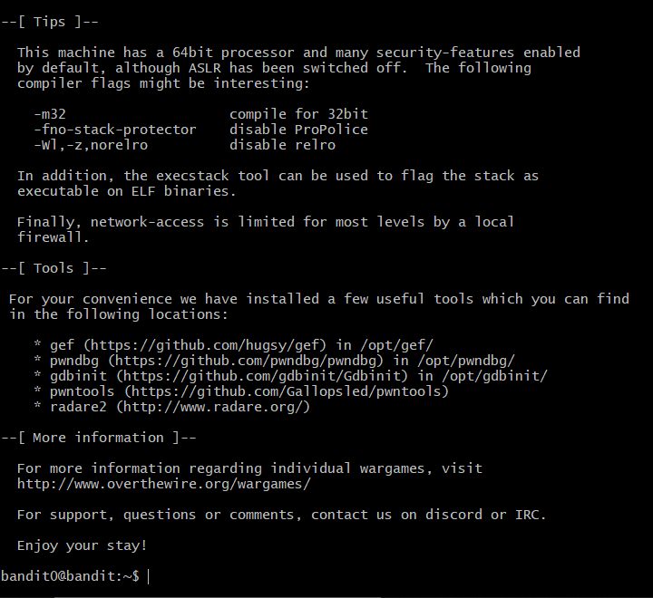
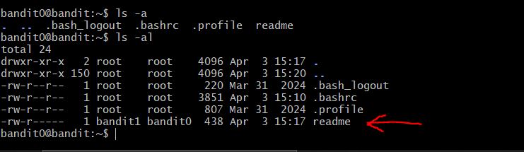
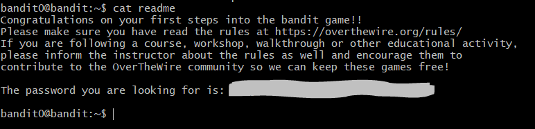

# OverTheWire: Bandit — Writeup

> **Platform:** [OverTheWire](https://overthewire.org/wargames/bandit/)  
> **Wargame:** Bandit  
> **Level:** 0 → 1  
> **Difficulty:** ⭐☆☆☆☆ (Beginner)

---

## 🎯 Level Goal

**Level 0:**
> *"The goal of this level is for you to log into the game using SSH. The host to which you need to connect is `bandit.labs.overthewire.org`, on port `2220`. The username is `bandit0` and the password is `bandit0`. Once logged in, go to the Level 1 page to find out how to beat Level 1."*

**Level 0 → Level 1:**
> *"The password for the next level is stored in a file called `readme` located in the home directory. Use this password to log into bandit1 using SSH. Whenever you find a password for a level, use SSH (on port 2220) to log into that level and continue the game."*

> 💡 **Tips dari OverTheWire:** Buat file catatan di komputer lokal kamu untuk menyimpan password setiap level! Password tidak tersimpan otomatis — jika tidak dicatat, kamu harus mulai ulang dari bandit0. Password juga bisa berubah sewaktu-waktu, jadi catat juga cara menyelesaikan setiap challenge.

---

## 🛠️ Commands yang Digunakan

| Command | Fungsi |
|---------|--------|
| `ssh` | Menghubungkan ke remote server secara aman |
| `ls` | Melihat daftar file dalam direktori |
| `cd` | Berpindah antar direktori |
| `cat` | Membaca isi file |
| `file` | Mendeteksi tipe/jenis sebuah file |
| `du` | Melihat ukuran file atau direktori |
| `find` | Mencari file berdasarkan kriteria tertentu |

> *Pada level ini, command yang benar-benar dipakai adalah `ssh`, `ls`, dan `cat`. Command lainnya akan lebih relevan di level-level berikutnya.*

---

## 📖 Konsep yang Dipelajari

- **SSH (Secure Shell):** Protokol jaringan untuk mengakses server jarak jauh secara terenkripsi.
- **Port non-standar:** SSH biasanya menggunakan port `22`, namun di sini menggunakan port `2220` (ditentukan dengan flag `-p`).
- **Navigasi direktori Linux:** Menggunakan `ls` untuk melihat file, termasuk file tersembunyi dengan flag `-a`.
- **Membaca file:** Menggunakan `cat` untuk menampilkan isi file ke terminal.

---

## 🔍 Langkah-Langkah Penyelesaian

### Step 1 — Menjalankan perintah SSH

Buka terminal (di sini menggunakan Git Bash / MINGW64 di Windows) dan jalankan perintah berikut untuk terhubung ke server OverTheWire:

```bash
ssh bandit0@bandit.labs.overthewire.org -p 2220
```

- `bandit0` → username untuk level 0
- `bandit.labs.overthewire.org` → hostname server
- `-p 2220` → menentukan port non-standar



---

### Step 2 — Memasukkan Password

Server akan menampilkan banner **Bandit** dan meminta password. Masukkan password `bandit0` (sesuai instruksi level goal).



---

### Step 3 — Berhasil Login ke Server

Setelah password diterima, muncul pesan selamat datang dari OverTheWire. Kita sudah berada di dalam server sebagai user `bandit0`.





> **Catatan:** Pesan ini berisi informasi penting seperti tips, tools yang tersedia, dan aturan bermain. Baca dengan seksama!

---

### Step 4 — Melihat Isi Direktori

Gunakan perintah `ls -a` dan `ls -al` untuk melihat semua file di direktori home, termasuk file tersembunyi.

```bash
ls -a
ls -al
```

Dari output, terlihat ada file bernama **`readme`** yang dimiliki oleh `bandit1` (grup `bandit0`), artinya kita bisa membacanya.



---

### Step 5 — Membaca File `readme`

Gunakan perintah `cat` untuk membaca isi file `readme`:

```bash
cat readme
```

File ini berisi pesan selamat dan **password untuk level berikutnya (Level 1)**.



---

## 🚩 Flag / Password Level 1

```
[REDACTED]
```

> 🔒 Password disensor. Temukan sendiri dengan mengikuti langkah-langkah di atas!

---

## 📝 Ringkasan

```
ssh bandit0@bandit.labs.overthewire.org -p 2220
# Password: bandit0

ls -al        # Temukan file 'readme'
cat readme    # Baca password untuk Level 1
```

Level 0 ini dirancang untuk memperkenalkan cara dasar mengakses server menggunakan SSH dan bernavigasi di lingkungan Linux. Flag tersembunyi di file `readme` yang mudah ditemukan dengan `ls` dan dibaca dengan `cat`.

---

*Writeup ini dibuat untuk keperluan edukasi. Happy hacking! 🏴*

---

<div align="center">

© 2025 **Ech0_F0xtr0t** — All rights reserved.  
*Writeup ini dibuat untuk tujuan edukasi. Dilarang menyebarkan ulang tanpa izin.*

</div>