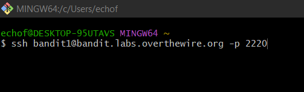
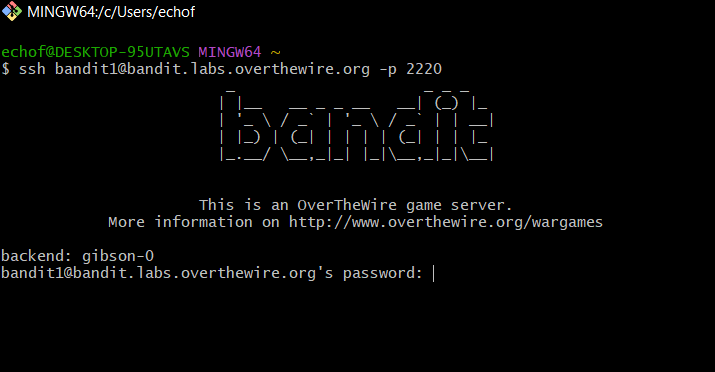
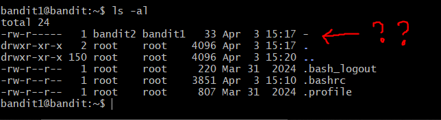
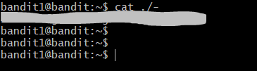

# OverTheWire: Bandit — Writeup

> **Platform:** [OverTheWire](https://overthewire.org/wargames/bandit/)  
> **Wargame:** Bandit  
> **Level:** 1 → 2  
> **Difficulty:** ⭐☆☆☆☆ (Beginner)

---

## 🎯 Level Goal

> *"The password for the next level is stored in a file called `-` located in the home directory."*

Tantangan di level ini adalah nama filenya adalah **`-`** (tanda strip/dash), yang merupakan karakter spesial di Linux. Jika langsung ditulis `cat -`, terminal akan menganggap itu sebagai flag input dari stdin, bukan nama file!

---

## 🛠️ Commands yang Digunakan

| Command | Fungsi |
|---------|--------|
| `ssh` | Menghubungkan ke remote server secara aman |
| `ls` | Melihat daftar file dalam direktori |
| `cd` | Berpindah antar direktori |
| `cat` | Membaca isi file |
| `file` | Mendeteksi tipe/jenis sebuah file |
| `du` | Melihat ukuran file atau direktori |
| `find` | Mencari file berdasarkan kriteria tertentu |

> *Pada level ini, command yang benar-benar dipakai adalah `ssh`, `ls`, dan `cat ./-`.*

---

## 📖 Konsep yang Dipelajari

- **Dashed filename (`-`):** Karakter `-` memiliki makna khusus di bash — digunakan sebagai penanda stdin/stdout. Untuk membaca file bernama `-`, kita harus menyertakan path eksplisit agar shell tahu kita merujuk ke file, bukan flag.
- **Path eksplisit dengan `./`:** Dengan menulis `./-`, kita memberitahu shell bahwa `-` adalah file di direktori saat ini (`./`), bukan opsi command.
- **Special Characters di Bash:** Beberapa karakter seperti `-`, `~`, `*`, dan `&` memiliki fungsi khusus dan perlu diperlakukan berbeda saat digunakan sebagai nama file.

---

## 🔍 Langkah-Langkah Penyelesaian

### Step 1 — Login ke Bandit Level 1 via SSH

Gunakan password yang ditemukan di Level 0 untuk login sebagai `bandit1`:

```bash
ssh bandit1@bandit.labs.overthewire.org -p 2220
```



---

### Step 2 — Memasukkan Password

Server menampilkan banner Bandit dan meminta password. Masukkan password yang didapat dari Level 0.



---

### Step 3 — Melihat Isi Direktori

Setelah berhasil login, jalankan `ls -al` untuk melihat seluruh file di direktori home:

```bash
ls -al
```

Terlihat ada sebuah file bernama **`-`** (hanya tanda strip). File ini dimiliki oleh `bandit2` (grup `bandit1`), sehingga kita punya izin membacanya.



> ❓ **Mengapa ada tanda tanya?** Karena jika langsung dijalankan `cat -`, terminal tidak akan membaca file tersebut — melainkan menunggu input dari keyboard (stdin). Ini adalah trik yang sengaja dibuat di level ini!

---

### Step 4 — Membaca File `-` dengan Path Eksplisit

Solusinya adalah menggunakan path eksplisit `./-` agar shell mengenali `-` sebagai nama file, bukan flag:

```bash
cat ./-
```

Password untuk Level 2 pun berhasil ditampilkan.



---

## 🚩 Flag / Password Level 2

```
[REDACTED]
```

> 🔒 Password disensor. Temukan sendiri dengan mengikuti langkah-langkah di atas!

---

## 📝 Ringkasan

```bash
ssh bandit1@bandit.labs.overthewire.org -p 2220
# Password: [hasil dari Level 0]

ls -al        # Temukan file bernama '-'
cat ./-       # Baca file dengan path eksplisit
```

Level 1 mengajarkan bahwa nama file bisa mengandung karakter spesial yang membingungkan shell. Solusinya sederhana: selalu gunakan path eksplisit `./` saat berhadapan dengan nama file yang tidak biasa.

---

*Writeup ini dibuat untuk keperluan edukasi. Happy hacking! 🏴*

---

<div align="center">

© 2025 **Ech0_F0xtr0t** — All rights reserved.  
*Writeup ini dibuat untuk tujuan edukasi. Dilarang menyebarkan ulang tanpa izin.*

</div>