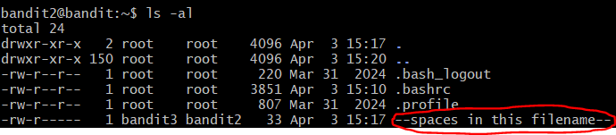
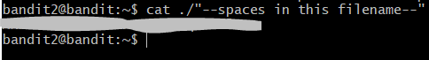

# OverTheWire: Bandit — Writeup

> **Platform:** [OverTheWire](https://overthewire.org/wargames/bandit/)  
> **Wargame:** Bandit  
> **Level:** 2 → 3  
> **Difficulty:** ⭐☆☆☆☆ (Beginner)

---

## 🎯 Level Goal

> *"The password for the next level is stored in a file called `--spaces in this filename--` located in the home directory."*

Tantangan di level ini adalah nama filenya mengandung **spasi**. Jika langsung ditulis `cat --spaces in this filename--`, shell akan memisahkan setiap kata sebagai argumen yang berbeda dan tidak akan menemukan file yang dimaksud!

---

## 🛠️ Commands yang Digunakan

| Command | Fungsi |
|---------|--------|
| `ssh` | Menghubungkan ke remote server secara aman |
| `ls` | Melihat daftar file dalam direktori |
| `cd` | Berpindah antar direktori |
| `cat` | Membaca isi file |
| `file` | Mendeteksi tipe/jenis sebuah file |
| `du` | Melihat ukuran file atau direktori |
| `find` | Mencari file berdasarkan kriteria tertentu |

> *Pada level ini, command yang benar-benar dipakai adalah `ssh`, `ls`, dan `cat` dengan nama file dikutip.*

---

## 📖 Konsep yang Dipelajari

- **Spasi dalam nama file:** Spasi adalah pemisah argumen di bash. Jika nama file mengandung spasi, shell akan memecahnya menjadi beberapa argumen terpisah.
- **Quoting (`" "` atau `' '`):** Membungkus nama file dengan tanda kutip memberitahu shell untuk memperlakukan seluruh string — termasuk spasi — sebagai satu kesatuan nama file.
- **Escape character (`\ `):** Alternatif lain adalah menggunakan backslash sebelum setiap spasi (misal: `cat --spaces\ in\ this\ filename--`), yang memiliki efek yang sama.
- **Tab Completion:** Cara termudah adalah mengetik sebagian nama file lalu tekan `Tab` — shell akan otomatis melengkapi nama file dengan escape yang tepat.

---

## 🔍 Langkah-Langkah Penyelesaian

### Step 1 — Login & Melihat Isi Direktori

Setelah login sebagai `bandit2` menggunakan password dari Level 1, jalankan `ls -al` untuk melihat isi direktori:

```bash
ssh bandit2@bandit.labs.overthewire.org -p 2220
ls -al
```

Terlihat file bernama **`--spaces in this filename--`** yang dimiliki oleh `bandit3` (grup `bandit2`).



---

### Step 2 — Membaca File dengan Nama Berisi Spasi

Gunakan tanda kutip (`"..."`) untuk membungkus nama file agar shell memperlakukannya sebagai satu argumen. Kita juga tetap menggunakan `./` sebagai path eksplisit:

```bash
cat ./"--spaces in this filename--"
```

> **Alternatif lain yang juga valid:**
> ```bash
> cat './--spaces in this filename--'
> cat ./'--spaces in this filename--'
> cat --spaces\ in\ this\ filename--
> ```

Password untuk Level 3 pun berhasil ditampilkan.



---

## 🚩 Flag / Password Level 3

```
[REDACTED]
```

> 🔒 Password disensor. Temukan sendiri dengan mengikuti langkah-langkah di atas!

---

## 📝 Ringkasan

```bash
ssh bandit2@bandit.labs.overthewire.org -p 2220
# Password: [hasil dari Level 1]

ls -al                                  # Temukan file dengan nama berisi spasi
cat ./"--spaces in this filename--"     # Baca file menggunakan tanda kutip
```

Level 2 mengajarkan cara menangani nama file yang mengandung spasi di Linux. Kunci utamanya adalah selalu gunakan tanda kutip atau escape character saat berhadapan dengan nama file yang tidak konvensional.

---

*Writeup ini dibuat untuk keperluan edukasi. Happy hacking! 🏴*

---

<div align="center">

© 2025 **Ech0_F0xtr0t** — All rights reserved.  
*Writeup ini dibuat untuk tujuan edukasi. Dilarang menyebarkan ulang tanpa izin.*

</div>
