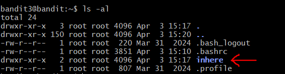
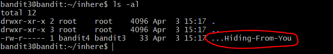
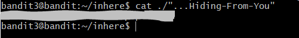

# OverTheWire: Bandit — Writeup

> **Platform:** [OverTheWire](https://overthewire.org/wargames/bandit/)  
> **Wargame:** Bandit  
> **Level:** 3 → 4  
> **Difficulty:** ⭐☆☆☆☆ (Beginner)

---

## 🎯 Level Goal

> *"The password for the next level is stored in a hidden file in the `inhere` directory."*

Tantangan di level ini adalah file yang menyimpan password adalah **file tersembunyi** (*hidden file*) di dalam sebuah subdirektori. Di Linux, file tersembunyi ditandai dengan awalan titik (`.`) pada nama filenya dan tidak akan muncul saat menjalankan `ls` biasa.

---

## 🛠️ Commands yang Digunakan

| Command | Fungsi |
|---------|--------|
| `ssh` | Menghubungkan ke remote server secara aman |
| `ls` | Melihat daftar file dalam direktori |
| `cd` | Berpindah antar direktori |
| `cat` | Membaca isi file |
| `file` | Mendeteksi tipe/jenis sebuah file |
| `du` | Melihat ukuran file atau direktori |
| `find` | Mencari file berdasarkan kriteria tertentu |

> *Pada level ini, command yang benar-benar dipakai adalah `ssh`, `ls -al`, `cd`, dan `cat`.*

---

## 📖 Konsep yang Dipelajari

- **Hidden file di Linux:** File yang namanya diawali dengan titik (`.`) akan disembunyikan dari perintah `ls` biasa. Untuk menampilkannya, gunakan flag `-a` (all).
- **Flag `ls -al`:** Kombinasi `-a` (tampilkan semua file termasuk hidden) dan `-l` (tampilkan detail lengkap seperti izin, pemilik, dan ukuran).
- **Navigasi direktori dengan `cd`:** Digunakan untuk masuk ke dalam subdirektori sebelum mencari file di dalamnya.
- **Nama file dengan titik-titik (`...`):** Nama file bisa diawali banyak titik sekaligus — ini bukan hal yang umum, tapi tetap valid di Linux.

---

## 🔍 Langkah-Langkah Penyelesaian

### Step 1 — Login & Melihat Isi Direktori Home

Setelah login sebagai `bandit3` menggunakan password dari Level 2, jalankan `ls -al`:

```bash
ssh bandit3@bandit.labs.overthewire.org -p 2220
ls -al
```

Terlihat ada sebuah direktori bernama **`inhere`**. Di sinilah file tersembunyi berada.



---

### Step 2 — Masuk ke Direktori `inhere`

Gunakan `cd` untuk berpindah ke dalam direktori `inhere`:

```bash
cd inhere
```


---

### Step 3 — Menemukan File Tersembunyi

Jalankan `ls -al` di dalam direktori `inhere` untuk menampilkan **semua** file, termasuk yang tersembunyi:

```bash
ls -al
```

Muncul sebuah file bernama **`...Hiding-From-You`** — file tersembunyi dengan nama yang cukup unik! File ini dimiliki oleh `bandit4` (grup `bandit3`), sehingga kita punya izin membacanya.



> 💡 **Kenapa `ls` biasa tidak menampilkan file ini?** Karena nama file diawali dengan titik (`.`), sehingga dianggap *hidden* oleh sistem. Flag `-a` pada `ls` diperlukan untuk menampilkannya.

---

### Step 4 — Membaca File Tersembunyi

Gunakan `cat` dengan tanda kutip karena nama file mengandung titik dan tanda hubung:

```bash
cat ./"...Hiding-From-You"
```

Password untuk Level 4 pun berhasil ditampilkan.



---

## 🚩 Flag / Password Level 4

```
[REDACTED]
```

> 🔒 Password disensor. Temukan sendiri dengan mengikuti langkah-langkah di atas!

---

## 📝 Ringkasan

```bash
ssh bandit3@bandit.labs.overthewire.org -p 2220
# Password: [hasil dari Level 2]

ls -al                          # Temukan direktori 'inhere'
cd inhere                       # Masuk ke direktori inhere
ls -al                          # Temukan hidden file '...Hiding-From-You'
cat ./"...Hiding-From-You"      # Baca file tersembunyi
```

Level 3 mengajarkan cara menemukan dan membaca *hidden file* di Linux. Kunci utamanya adalah selalu gunakan `ls -al` agar tidak ada file yang terlewat, terutama yang namanya diawali dengan titik.

---

*Writeup ini dibuat untuk keperluan edukasi. Happy hacking! 🏴*

---

<div align="center">

© 2025 **Ech0_F0xtr0t** — All rights reserved.  
*Writeup ini dibuat untuk tujuan edukasi. Dilarang menyebarkan ulang tanpa izin.*

</div>
