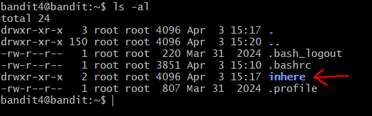
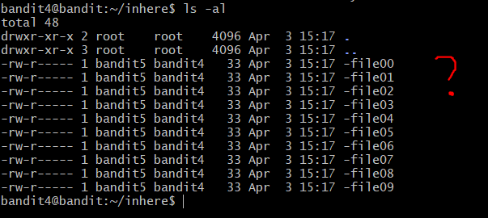
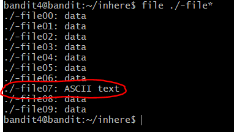
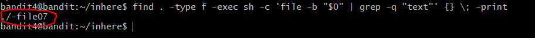
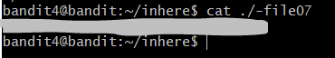

# OverTheWire: Bandit — Writeup

> **Platform:** [OverTheWire](https://overthewire.org/wargames/bandit/)  
> **Wargame:** Bandit  
> **Level:** 4 → 5  
> **Difficulty:** ⭐⭐☆☆☆ (Easy)

---

## 🎯 Level Goal

> *"The password for the next level is stored in the only human-readable file in the `inhere` directory."*
>
> *Tip: if your terminal is messed up, try the `reset` command.*

Tantangan di level ini adalah terdapat **10 file** di dalam direktori `inhere` (`-file00` hingga `-file09`), namun hanya **satu** yang berisi teks yang bisa dibaca manusia (*human-readable* / ASCII text). Sisanya berisi data biner yang akan mengacaukan tampilan terminal jika dibuka sembarangan.

---

## 🛠️ Commands yang Digunakan

| Command | Fungsi |
|---------|--------|
| `ssh` | Menghubungkan ke remote server secara aman |
| `ls` | Melihat daftar file dalam direktori |
| `cd` | Berpindah antar direktori |
| `cat` | Membaca isi file |
| `file` | Mendeteksi tipe/jenis sebuah file |
| `find` | Mencari file berdasarkan kriteria tertentu |

---

## 📖 Konsep yang Dipelajari

- **Human-readable vs Binary file:** File teks (*ASCII text*) berisi karakter yang bisa dibaca manusia. File biner (*data*) berisi byte mentah yang tidak bermakna jika ditampilkan di terminal dan bisa merusak tampilan.
- **`file` command:** Digunakan untuk mendeteksi tipe sebuah file tanpa harus membukanya. Sangat berguna saat berhadapan dengan banyak file yang tidak diketahui isinya.
- **Wildcard `*`:** Karakter `*` digunakan untuk mencocokkan banyak file sekaligus. `./-file*` akan mencocokkan semua file yang namanya diawali `-file` di direktori saat ini.
- **`find` dengan `-exec`:** Cara yang lebih powerful untuk mencari file berdasarkan kriteria tertentu, termasuk menjalankan perintah lain pada setiap file yang ditemukan.
- **`reset` command:** Jika terminal kacau akibat membaca file biner, perintah `reset` akan mengembalikan tampilan terminal ke kondisi normal.

---

## 🔍 Langkah-Langkah Penyelesaian

### Step 1 — Login & Melihat Isi Direktori Home

Setelah login sebagai `bandit4`, jalankan `ls -al` untuk melihat isi direktori. Terlihat ada direktori **`inhere`**.

```bash
ssh bandit4@bandit.labs.overthewire.org -p 2220
ls -al
```



---

### Step 2 — Masuk ke `inhere` & Lihat Isinya

Masuk ke direktori `inhere` lalu jalankan `ls -al`:

```bash
cd inhere
ls -al
```

Terdapat **10 file** bernama `-file00` hingga `-file09`. Semua ukurannya sama (33 bytes). Tidak ada petunjuk dari nama atau ukuran file — kita perlu cara lain untuk menemukan yang *human-readable*!



---

### Step 3 — Menemukan File Human-Readable (2 Cara)

#### 🅰️ Cara A — Menggunakan `file` dengan Wildcard

Gunakan perintah `file` dengan wildcard `*` untuk mengecek tipe semua file sekaligus:

```bash
file ./-file*
```

Dari output, terlihat bahwa **`-file07`** adalah satu-satunya file bertipe **`ASCII text`**, sementara file lainnya bertipe `data` (biner).



---

#### 🅱️ Cara B — Menggunakan `find` dengan `-exec`

Cara alternatif yang lebih powerful menggunakan `find` dikombinasikan dengan `file` dan `grep`:

```bash
find . -type f -exec sh -c 'file -b "$0" | grep -q "text"' {} \; -print
```

Penjelasan perintah:
- `find . -type f` → cari semua file di direktori saat ini
- `-exec sh -c 'file -b "$0" | grep -q "text"' {} \;` → jalankan `file` pada setiap file, filter yang mengandung kata "text"
- `-print` → tampilkan nama file yang lolos filter

Hasilnya sama: **`-file07`** adalah file yang dicari.



---

### Step 4 — Membaca File `-file07`

Setelah diketahui bahwa `-file07` adalah file yang *human-readable*, baca isinya dengan `cat`:

```bash
cat ./-file07
```

Password untuk Level 5 pun berhasil ditampilkan.



> ⚠️ **Perhatian:** Jangan coba membuka file lainnya (yang bertipe `data`) dengan `cat` — isinya adalah data biner yang bisa mengacaukan tampilan terminal. Jika ini terjadi, jalankan perintah `reset` untuk memulihkan terminal.

---

## 🚩 Flag / Password Level 5

```
[REDACTED]
```

> 🔒 Password disensor. Temukan sendiri dengan mengikuti langkah-langkah di atas!

---

## 📝 Ringkasan

```bash
ssh bandit4@bandit.labs.overthewire.org -p 2220
# Password: [hasil dari Level 3]

ls -al                    # Temukan direktori 'inhere'
cd inhere
ls -al                    # Lihat 10 file (-file00 s/d -file09)

# Cara A: cek tipe semua file sekaligus
file ./-file*             # -file07 adalah ASCII text

# Cara B: gunakan find + exec
find . -type f -exec sh -c 'file -b "$0" | grep -q "text"' {} \; -print

cat ./-file07             # Baca file human-readable
```

Level 4 mengajarkan pentingnya perintah `file` untuk mengidentifikasi tipe file tanpa harus membukanya. Ini adalah skill dasar yang sangat berguna di CTF maupun dunia nyata saat berhadapan dengan file yang tidak diketahui tipenya.

---

*Writeup ini dibuat untuk keperluan edukasi. Happy hacking! 🏴*

---

<div align="center">

© 2025 **Ech0_F0xtr0t** — All rights reserved.  
*Writeup ini dibuat untuk tujuan edukasi. Dilarang menyebarkan ulang tanpa izin.*

</div>
