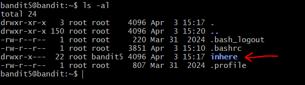
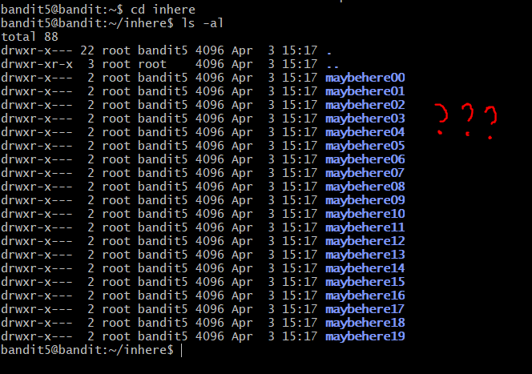
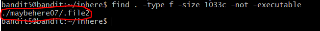
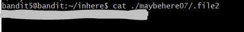

# OverTheWire: Bandit — Writeup

> **Platform:** [OverTheWire](https://overthewire.org/wargames/bandit/)  
> **Wargame:** Bandit  
> **Level:** 5 → 6  
> **Difficulty:** ⭐⭐☆☆☆ (Easy)

---

## 🎯 Level Goal

> *"The password for the next level is stored in a file somewhere under the `inhere` directory and has all of the following properties:*
> 1. *human-readable*
> 2. *1033 bytes in size*
> 3. *not executable"*

Tantangan di level ini jauh lebih kompleks dari sebelumnya — terdapat **20 subdirektori** (`maybehere00` hingga `maybehere19`) di dalam `inhere`, dan masing-masing kemungkinan berisi banyak file. Mencari secara manual jelas tidak efisien. Solusinya: gunakan `find` dengan beberapa kriteria sekaligus untuk menyempitkan pencarian!

---

## 🛠️ Commands yang Digunakan

| Command | Fungsi |
|---------|--------|
| `ssh` | Menghubungkan ke remote server secara aman |
| `ls` | Melihat daftar file dalam direktori |
| `cd` | Berpindah antar direktori |
| `cat` | Membaca isi file |
| `file` | Mendeteksi tipe/jenis sebuah file |
| `du` | Melihat ukuran file atau direktori |
| `find` | Mencari file berdasarkan kriteria tertentu |

---

## 📖 Konsep yang Dipelajari

- **`find` multi-kriteria:** Perintah `find` bisa dikombinasikan dengan banyak flag sekaligus untuk menyaring file berdasarkan beberapa syarat — tipe, ukuran, izin eksekusi, dan lainnya.
- **`-size` flag:** Digunakan untuk memfilter file berdasarkan ukuran. Satuan `c` berarti *bytes*, sehingga `-size 1033c` artinya tepat 1033 bytes.
- **`-not -executable` flag:** Memfilter file yang **tidak** memiliki izin eksekusi (`-executable` = bisa dieksekusi, `-not -executable` = kebalikannya).
- **`-type f` flag:** Membatasi pencarian hanya pada file biasa (bukan direktori, symlink, dsb.).
- **Pencarian rekursif:** `find` secara default mencari secara rekursif ke semua subdirektori, sangat cocok untuk struktur direktori bersarang seperti di level ini.

---

## 🔍 Langkah-Langkah Penyelesaian

### Step 1 — Login & Melihat Isi Direktori Home

Setelah login sebagai `bandit5`, jalankan `ls -al`. Terlihat direktori **`inhere`** dengan izin `drwxr-x---`.

```bash
ssh bandit5@bandit.labs.overthewire.org -p 2220
ls -al
```



---

### Step 2 — Masuk ke `inhere` & Lihat Isinya

```bash
cd inhere
ls -al
```

Terdapat **20 subdirektori** bernama `maybehere00` hingga `maybehere19`. Tidak mungkin dicek satu per satu secara manual!



---

### Step 3 — Mencari File dengan `find` Multi-Kriteria

Gunakan `find` dengan kombinasi tiga kriteria sesuai petunjuk level goal:

```bash
find . -type f -size 1033c -not -executable
```

Penjelasan flag:
- `-type f` → hanya cari file biasa (bukan direktori)
- `-size 1033c` → ukuran tepat **1033 bytes**
- `-not -executable` → file yang **tidak** bisa dieksekusi

Hasilnya langsung menunjuk ke satu file: **`./maybehere07/.file2`**



---

### Step 4 — Membaca File yang Ditemukan

```bash
cat ./maybehere07/.file2
```

Password untuk Level 6 pun berhasil ditampilkan.



> 💡 **Menarik:** File tersebut juga merupakan *hidden file* (diawali titik `.`) yang tersimpan di dalam subdirektori `maybehere07`. Tanpa `find`, file ini hampir mustahil ditemukan secara manual!

---

## 🚩 Flag / Password Level 6

```
[REDACTED]
```

> 🔒 Password disensor. Temukan sendiri dengan mengikuti langkah-langkah di atas!

---

## 📝 Ringkasan

```bash
ssh bandit5@bandit.labs.overthewire.org -p 2220
# Password: [hasil dari Level 4]

ls -al                                      # Temukan direktori 'inhere'
cd inhere
ls -al                                      # Lihat 20 subdirektori maybehere

find . -type f -size 1033c -not -executable # Filter file sesuai 3 kriteria
cat ./maybehere07/.file2                    # Baca file yang ditemukan
```

Level 5 mengajarkan kekuatan sesungguhnya dari perintah `find` — dengan menggabungkan beberapa flag kriteria, kita bisa menemukan satu file spesifik di antara ratusan file hanya dalam satu perintah. Kemampuan ini sangat krusial di level-level Bandit berikutnya!

---

*Writeup ini dibuat untuk keperluan edukasi. Happy hacking! 🏴*

---

<div align="center">

© 2025 **Ech0_F0xtr0t** — All rights reserved.  
*Writeup ini dibuat untuk tujuan edukasi. Dilarang menyebarkan ulang tanpa izin.*

</div>
